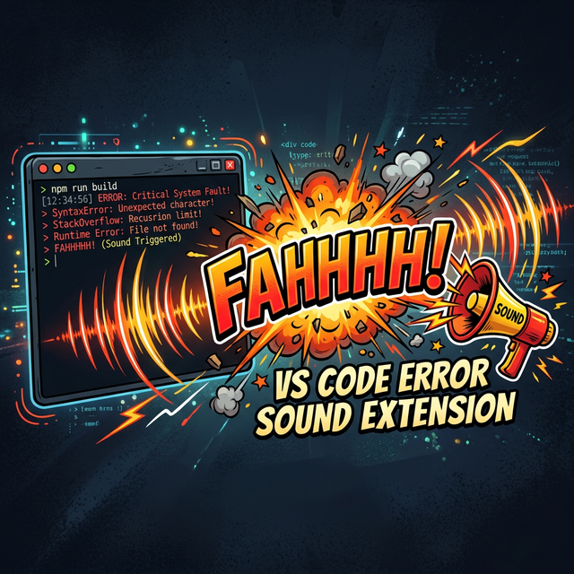

<p align="center">
  
</p>

# 💥 Fahhhhh Error Sound

> **Your terminal messed up? FAHHHHH!**

Ever wished your terminal could audibly shame you when a command fails? Well now it can. **Fahhhhh Error Sound** plays a dramatic "fahhhhh" sound clip every time a command in your VS Code terminal exits with a non-zero code.

Typo in your command? **FAHHHHH.**
Build failed? **FAHHHHH.**
Tests crashed? **FAHHHHH.**

---

## 🎬 How It Works

This extension hooks into VS Code's **Shell Integration API** and listens for terminal commands that exit with a failure code (`exit code ≠ 0`).

When that happens, it instantly plays your `fahhh.mp3` sound file using the **Windows MCI audio driver** — a low-level, blazing-fast audio API that spawns an independent process for each playback. No singletons, no conflicts, no missed sounds.

```
you@pc:~$ npm run build
> ERROR: Module not found...

🔊 FAHHHHH!
```

---

## 🚀 Features

- 🔊 **Instant audio feedback** on every failed terminal command
- ⚡ **Zero-latency playback** via Windows MCI API (`winmm.dll`)
- 🔁 **Plays every single time** — no cooldown, no skipping, no singleton issues
- 🧩 **Stable API only** — uses `onDidEndTerminalShellExecution` (no proposed APIs)
- 🪶 **Lightweight** — no dependencies, no bloat

---

## 📦 Installation

### From the Marketplace
Search for **"Fahhhhh Error Sound"** in the VS Code Extensions panel (`Ctrl+Shift+X`) and click Install.

### From VSIX
1. Download the `.vsix` file from the [Releases](https://github.com/mohan/fahhhhh-error-sound/releases) page.
2. In VS Code, open the Extensions panel → click `...` → **Install from VSIX...**
3. Select the downloaded `.vsix` file.

---

## ⚙️ Requirements

- **Windows** (uses PowerShell + `winmm.dll` for audio playback)
- **VS Code 1.80+** with Shell Integration enabled (enabled by default)
- A `fahhh.mp3` file placed in the extension's `out/` directory (included by default)

---

## 🎵 Custom Sound

Want a different sound? Simply replace the `fahhh.mp3` file in the extension's `out/` folder with your own `.mp3` file. Just make sure to rename it to `fahhh.mp3`.

---

## 🛠️ How It's Built

| Layer | Tech |
|---|---|
| **Error Detection** | `vscode.window.onDidEndTerminalShellExecution` — stable VS Code API |
| **Audio Engine** | `mciSendStringA` from `winmm.dll` via PowerShell |
| **Process Model** | Each sound is a detached, independent `spawn()` process |

---

## 🤝 Contributing

Got ideas? Found a bug? Want to add Linux/macOS support? PRs are welcome!

1. Fork the repo
2. Create your feature branch (`git checkout -b feature/amazing`)
3. Commit your changes (`git commit -m 'Add amazing feature'`)
4. Push to the branch (`git push origin feature/amazing`)
5. Open a Pull Request

---

## 📄 License

MIT © [mohan](https://github.com/mohan)

---

<p align="center">
  <b>Made with frustration and love 💢❤️</b>
</p>
